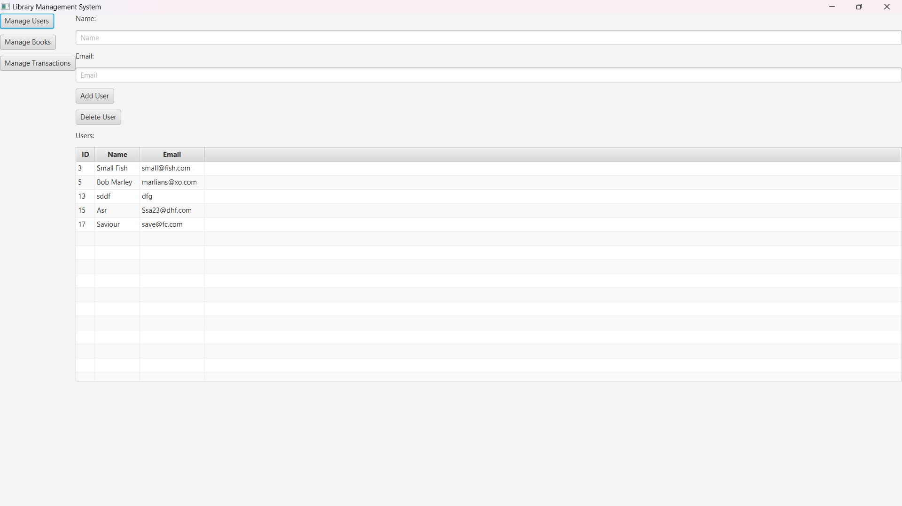
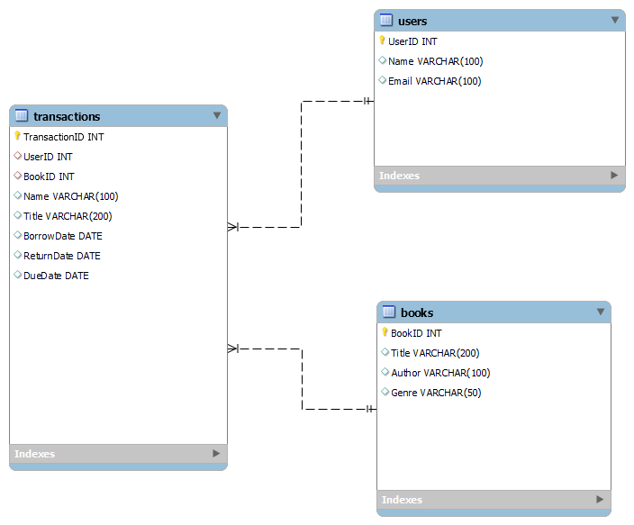

# Advanced Library Management System

The Advanced Library Management System project is designed to provide a comprehensive learning experience in various areas of Java programming as well as software engineering such as Object-Oriented programming, data structures, database Management and JDBC utilization.

The Library Management System is a simple user-friendly app created using JavaFx. It designed to allow the librarian manage users, books and handle borrowing and returning of the a book.

## Features and Functionalities
### User Management
- Add User: Register new user with name and email address.
- Delete User: Delete a user from the system.

### Book Management
- Add New Books: Register new books with title and author.
- Delete Books: Remove books from the system.

### Transaction Management
- Issue Books: Issue books to patrons, recording the date of issue and due date.
- Return Books: Process the return of books and update the system accordingly.

# Project Milestones
## Day 1: Planning and Setup
- Define project requirements and objectives.
- Set up the development environment (IDE, database, JavaFX).
- Design database schema and create necessary tables.
- Implement the basic class structure for library entities.

## Day 2: Object-Oriented Programming and Data Structures
- Implement remaining class functionalities with OOP principles.
- Implement linked lists for managing book lists and patron records.
- Implement stacks and queues for transaction management.
## Day 3: Database Design and SQL Skills
- Finalize database schema design and normalization.
- Write SQL queries for creating tables, inserting data, and basic CRUD operations.
- Integrate JDBC for database connectivity and execute SQL statements from Java code.
## Day 4: User Interface and Integration
- Develop JavaFX user interface for the library management system.
- Integrate the UI with backend functionality (OOP, data structures, database).
- Conduct thorough testing and debugging.
- Finalize project documentation and prepare for submission.

## Documentation

[Documentation](https://docs.google.com/document/d/12T5NgPTD-UPTNwNnOwOrfWmpxvpe6uKLkREHK5UiJ3Q/edit?usp=sharing)

# App Interface

# ER Design
